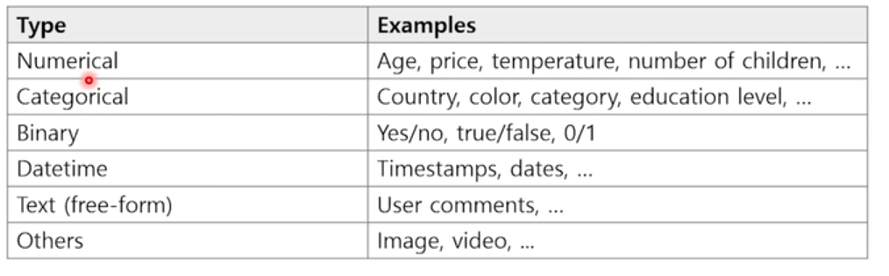
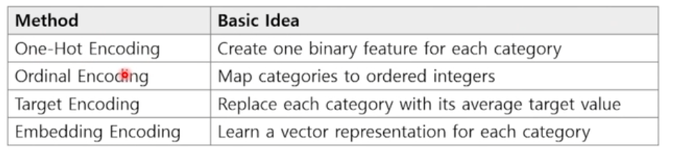
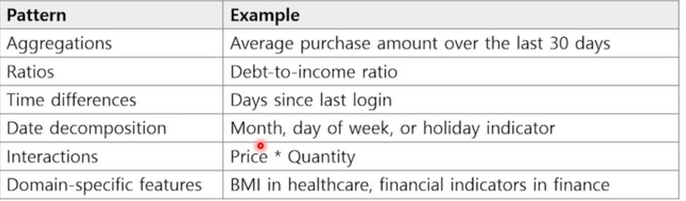
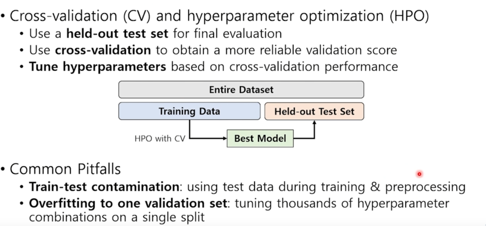

# Tabular ML
## What is Tabular Data
- row,columns가 있는 행과 열이 있는 표 형식 데이터

## Chrcteristics of Tabulr Data
- 열이 이질적이다

- 모델은 이러한 특징을 핸들링 할 수 있어야함

- 데이터의 특징이 Spatial 하거나 Sequential하지 않다
- 데이터가 천 개 이하
- 데이터가 적어서 모델이 학습하는 것이 어려움
- 어떤 관측 결과가 없을 수 있음(Missing entries)
- 데이터의 레이블이나 데이터가 노이즈하거나 불안정한 경우가 있음
  - 실제 환경에서 노이즈가 섞일 수 있긴 때문
- 데이터 Leakage문제
- 도메인 문제, 도메인 지식에 한정 될 수 있다
  - Tabular 데이터가 도메인의 종류에 따라 다르다
  - 종종 도메인 지식 때문에 한계를 느낄 수 있다
  - 도메인 지식을 알아야하고 어떤 부분이 중요하고 관계를 가지고 있는지 알아야한다

- Tabular data로 다루는 것이 중요
  - 데이터 개수가 적거나
  - 특징이 많거나
  - 도메인 지식이 없거나

 

## Tasks on Tabular Data
- Prediction(타겟을 예측)
  - Regression
  - classification

- 이상 탐지(Anomaly Detection)
  - unsupervised한 데이터로 학습

- Clustering
  - 비슷한 데이터를 묶는 것

- Question Answering
  - 자연어로 질문이 들어오면 테이블을 참고해서 답변

- 데이터 생성
  - 데이터를 공개하기 어려울 때
  - 유사한 데이터를 만들어서

 

## Machine Learning Pipeline
- Data Collection
  - 데이터 모으기
  - 어떻게 만들었는지 기록해놔야함

- EDA(Exploratory Data Analysis)
  - 데이터를 이해하는 과정

- Preprocessing
  - 모델이 잘 이해할 수 있게 데이터를 바꿔주는 작업이 필요(매우 중요)

- Modeling
  - 모델 선택, 학습

- Evaluation
  - 평가

- Deployment & Monitoring
  - 배포 및 모니터링

 

## Preprocessing
- 일관된 형태로 표현할 수 있어야됨 -> 모델이 이해하기 쉬움
- Handling missing values
- Encoding categorical variables
- Numerical feature transformations
- Feature engineering

### Handling missing values
- 빈 값에 채워주는 것이 좋을 수도 있음
- 자연스럽게 missing value를 잘 다루는 모델도 있음

### Encoding categorical variables

- 숫자 형태로 인코딩해야됨
- One-Hot Encoding(가장 많이 쓰임)

### Numerical feature transformations
- 정규분포
- min-max scaling
- 스케일링 필요하지 않은 경우도 있음
- 스케일링 할 때 의미를 잃어버리는 경우가 있으므로 잘 조절해야됨
- 분포에 기반해서 숫자를 바꾸는 경우

### Feature engineering
- 새로운 특징을 만들어내는 것(예측에 도움이 될만한)

## Evaluation for Tabular ML
- 하이퍼파라미터에 민감함
- Cross-validation을 통해 찾거나
- evaluation metrics를 잘 고르거나

### Cross-validation

- Trainging 데이터와 테스트 데이터가 섞이는 경우를 주의해야함

### Evaluation metrics
- 비율
- Binary classification
- AUC-ROC, AUC-PR

## Interpretability
- 왜 그렇게 예측했는가?