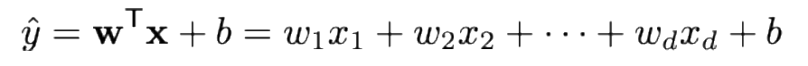
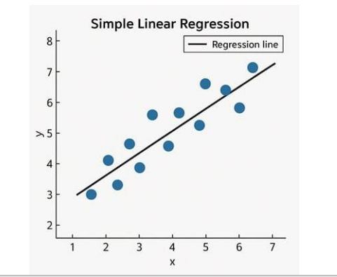
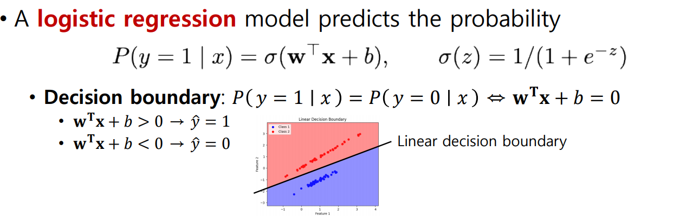
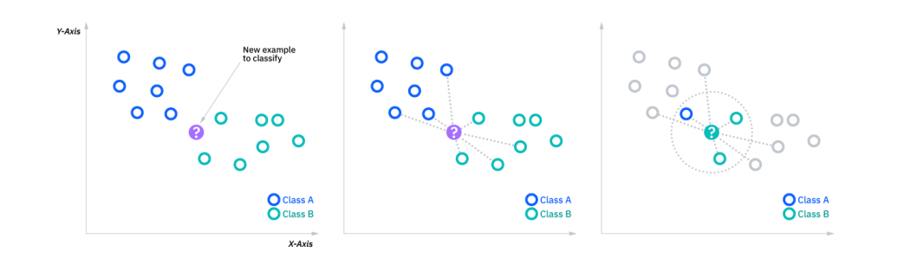
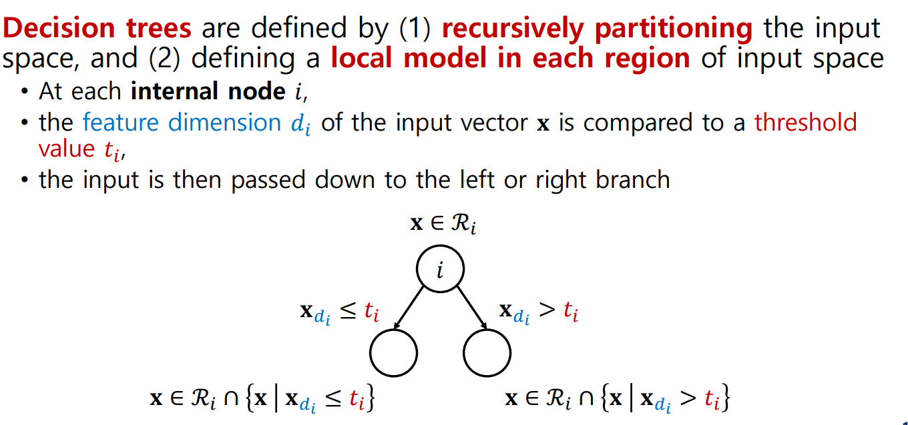
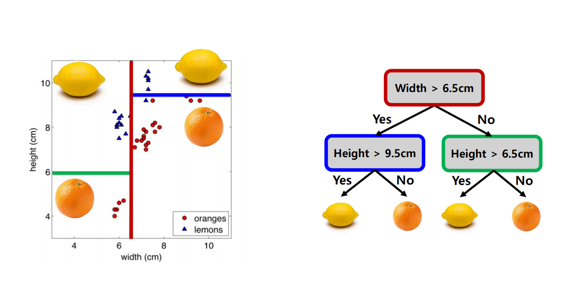

# Classical ML for Tabular Data
## Linear Regression
- features가 numerical
- 실숫값을 예측하기 위한 모델
- MSE를 최소화

- overfitting이 발생할 수 있음 -> regularization을 사용
  - Ridge(L2) regression
  - Lasso(L1) regression

- Consider binary classification
  - -무한대 ~ 무한대
  - 시그모이드 함수 사용

- 어떻게 학습할거냐?
- 일반적으로 cross-entropy를 사용

- 빠르다, 해석이 가능하다, 단순하다
- 성능이 괜찮다
- nonlinear pattern은 찾을 수 없음
- 매우 큰 feature값에 민감함
- 초기에 일단 linear하지 않더라도 일단 해보고 성능이 얼마나 나오는지 확인해보는 용도로 좋음

 

## K-Nearest Neighbors(kNN)
- 데이터가 주어졌을 때 그 데이터와 가까이 있는 데이터들은 비슷한 데이터 일 것이다

- 가깝다는 것을 어떻게 정의할 것인가?
  - 뉴클리안 거리
  - 맨해튼 거리
  - 코사인 거리
- Feature scaling이 중요함
- Feature들을 어떻게 표현 할 것인가
- Neighbors 갯수를 몇 개로 할 것인가?
  - 적은 이웃: 아주 비슷한 이웃들만 비교 노이즈에 민감해짐
  - 많은 이웃: 너무 스무스한 이웃들을 고를 수 있음
  - 홀수개로 고른 것도 중요 
- 간단하다, 직관적이다, non-linear decision을 학습할 수 있게됨
- 느릴 수 있고 메모리 사용이 많음
- feature에 따라서 민감해 질 수 있음

 

## Decision Trees

- leaf node에서 예측을 하게됨
- 영역에 들어오는 모든 값의 평균값을 구한다

- 어떻게 학습되는가?
  - 완벽하게 푸는 것은 불가능
  - greedy 방법
  - 델타 값은 재활용 가능
- entropy가 낮다는 것 -> 예측을 내릴 때 거의 일관되게 내릴 수 있다
- 매우 shallow하면 중요한 패턴을 놓쳤을 수 있음
- 너무 깊게 되면 overfitting 할 수 있음
- Pre-pruning: 충분히 복잡해지기 전에 더 이상 모델을 키우는 것을 멈추는 것
- Post-pruning: 일단 최대한 크게 만들고 불필요한 것을 자르는 것
- 어떻게 동작하는지 쉽게 이해가 됨
- 비선형 패턴 잘 확인
- feature scaling이 불필요
- 어느 정도키워야하는지 어려움
- 데이터가 적으면 unstable함

## Ensemble Methods
- 여러 개의 base model이 있고 이것을 모아서 예측을 하는 것
- 각각의 모델들이 다양하게 있어야함
- 어떻게 디자인 할 것인가?
- bagging
  - 데이터를 나누고 나누어진 데이터를 가지고 모델을 학습 -> 모아서 한꺼번에 예측 ex) 랜덤포레스트
  - 전부 개별적이지 않음 -> 하나의 데이터에서 나누어진 것이기 때문
  - 특정한 변동성을 주는 방식
    - 특정 데이터에서 특정 feature를 제거
    - 모델들을 다르게 학습
    - 랜덤 포레스트
      - 특정 데이터에서 특정 feature를 제거
- boosting
  - 순차적 학습
  - 현재 스텝에서는 지금까지의 모델들이 잘 학습하지 못하는 것을 학습
  - AdaBoost: 미스 학습된 것을 가중치를 더 둠
  - Gradient Boosting: 남아있는 loss를 없애는 방식
  - GBDT
    - XGBoost
    - LightGBM
    - CatBoost
